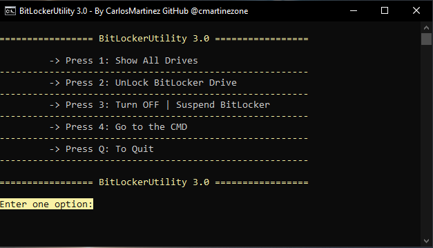

# BitLockerUtility 3.0
 Managing BitLocker From Windows PE (WinPE Enviroment).
 
 
 
BitLockerUtility has been developed using PowerShell to manipulating BitLocker in a fashion manner.
 
 * YouTube Video: https://www.youtube.com/watch?v=JgMLRPxh-MI&t=3s
 
 ## Features
* Shows Recovery Password ID Associated with The Recovery Key Password.
* Allows to UnLock BitLocker Drive encrypted ( RECOVERY KEY PASSWORD REQUIRED ).
* Allows to Suspend BitLocker Drive Unlocked.
* Allows to Turn OFF (Decrypt) BitLocker Drive Unlocked.
* Shows All Drives encrypted and not encrypted.
* Allows to Go to the Command-Line to access to Drive Unlocked Data.

 ## Deployment
* Use Rufus https://rufus.ie/ to Create Bootable USB Drive, Find the ISO file in the [Release tab](https://github.com/cmartinezone/BitLockerUtility/releases).
* Uploud the WIM image to your PXE Boot enviroment, find the WIM Image file in the [Release tab](https://github.com/cmartinezone/BitLockerUtility/releases).

## WinPE Support:
The Final ISO is generated using [Microsoft ADK Windows 10 v1909](https://docs.microsoft.com/en-us/windows-hardware/get-started/adk-install) back compatible with preveus Windows 10 versions, plus the help 
of my Project: [WinPeBuilder](https://github.com/cmartinezone/WinPEBuilder)
* Packages included: 
> HTA, WMI, StorageWMI, Scripting, NetFx, PowerShell, DismCmdlets, FMAPI, SecureBootCmdlets, EnhancedStorage,
SecureStartup (BitLocker Support).
* [Dell WinPE Drivers](https://www.dell.com/support/article/us/en/04/how13364/winpe-10-driver-pack?lang=en) - Included
* [HP WinPE Drivers](https://ftp.hp.com/pub/caps-softpaq/cmit/HP_WinPE_DriverPack.html) - Included

## Donation:
If this project helps, you can give me a cup of coffee :)

 
 

 

