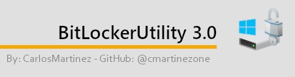

# BitLockerUtility 3.0
Managing Bitlocker From Windows PE (Winpe Environment).

BitLockerUtility 3.0  is developed using PowerShell to manipulating BitLocker in a fashion manner from WinPE Environment with a friendly user experiance of multiple chooses.

### Features:
- Shows Recovery Password ID Associated with The Recovery Key Password.
- Allows to **UnLock** BitLocker Drive Encrypted **(YOU MUST HAVE THE RECOVERY KEY PASSWORD)**.
- Allows to **Suspend** BitLocker .
- Allows to **Turn OFF** ( Decrypt ) BitLocker.
- Shows All Drives Encrypted and not Encrypted.
- Allows to Go to the Command-Line. 

### Use Cases:
- BitLocker Encrypted Computers.
- Operating system not booting with BlueScreen.
- Corrupted operating system.
- Reocery tool for attepting to repair Corrupted Operating system or Backup Data.

## Deployment:
- **PXE Boot Server Integration:** Download and Upload the ***WIM image*** to your PXE\WDS Server [Download](https://github.com/cmartinezone/BitLockerUtility/releases).
- **Bootable USB Drive:** Download the ***ISO File*** to Create a bootable USB Drive [Download](https://github.com/cmartinezone/BitLockerUtility/releases). You can use Rufus https://rufus.ie/ to Create a Bootable USB Drive.

### WinPE Support:
The Final **ISO Image** generates using [Microsoft ADK Windows 10 v1909](https://docs.microsoft.com/en-us/windows-hardware/get-started/adk-install) back-compatible with previous Windows 10 versions, plus the help of my Project :) -  [WinPeBuilder](https://github.com/cmartinezone/WinPEBuilder)
* WinPE Packages included: ***HTA, WMI, StorageWMI, Scripting, NetFx, PowerShell, DismCmdlets, FMAPI, SecureBootCmdlets, EnhancedStorage,
SecureStartup (BitLocker Support).***
* Inlcuded:  [Dell WinPE Drivers](https://www.dell.com/support/article/us/en/04/how13364/winpe-10-driver-pack?lang=en)
* Included: [HP WinPE Drivers](https://ftp.hp.com/pub/caps-softpaq/cmit/HP_WinPE_DriverPack.html)

### Author:
[**Carlos Martinez**](https://github.com/cmartinezone)

## Donate:
If this project helps, you can give me a cup of coffee ;).

 
 

 

