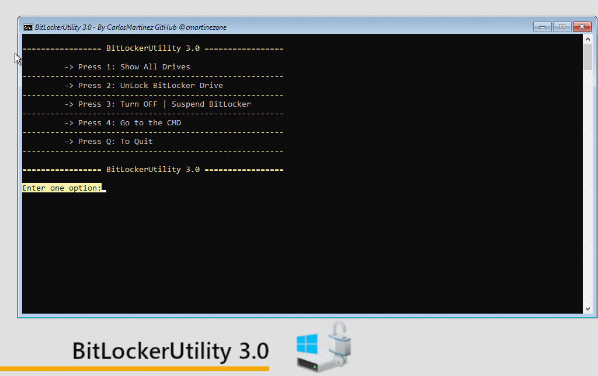
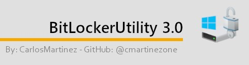

# 🔐 BitLockerUtility 3.0

A simple WinPE-based recovery tool designed for IT administrators and support technicians to access **BitLocker-encrypted drives** when Windows can no longer boot.



---

## What is BitLocker?

**BitLocker** is Microsoft's built-in drive encryption technology.

It is available in **Windows Professional** and **Enterprise** editions and encrypts the entire drive to help protect your data from unauthorized access.

Learn more about BitLocker:

https://docs.microsoft.com/en-us/windows/security/information-protection/bitlocker/bitlocker-overview

> **If Windows starts normally, your data remains fully accessible and no action is required.**

If Windows becomes corrupted or fails to start, BitLocker may prevent access to your files until the drive is unlocked with the recovery key.

---

## About BitLockerUtility

**BitLockerUtility 3.0** is built on **Windows PE (WinPE)** and uses a PowerShell interface around Microsoft's **manage-bde** command-line tool.

The goal is to provide a simple, guided interface that allows anyone with the **BitLocker Recovery Key** to unlock encrypted drives and recover their data.

---

## 🎥 Watch the Tool in Action

The following video demonstrates BitLockerUtility:

https://youtu.be/U2Z6I8SXYrg

---

# ✨ Main Features

- 🔑 Display the **Recovery ID** associated with an encrypted drive.
- 🔓 Unlock BitLocker-encrypted drives *(Recovery Key required)*.
- 🔄 Disable BitLocker and decrypt the drive.
- 💽 Display all storage devices, including encrypted and unencrypted drives.
- 💻 Open a Command Prompt for advanced troubleshooting.

---

> **Important**
>
> BitLockerUtility **does not repair damaged or corrupted BitLocker volumes**.
>
> If the encrypted drive itself is damaged, refer to Microsoft's **repair-bde** documentation:
>
> https://docs.microsoft.com/en-us/windows-server/administration/windows-commands/repair-bde

---

# 📌 Common Use Cases

BitLockerUtility is useful when:

- Windows fails to start.
- Windows becomes corrupted.
- A **Blue Screen (BSOD)** prevents Windows from booting.
- Startup Repair cannot recover the operating system.
- You need to recover files before reinstalling Windows.
- You need to decrypt a BitLocker drive outside of Windows.

---

# 🚀 Deployment

## PXE / WDS Deployment

Download the **WIM image** and add it to your PXE or Windows Deployment Services (WDS) server.

➡️ https://github.com/cmartinezone/BitLockerUtility/releases

---

## Bootable USB

Download the **ISO image** and create a bootable USB drive.

➡️ https://github.com/cmartinezone/BitLockerUtility/releases

We recommend using **Rufus** to create the bootable USB.

https://rufus.ie

---

# 🛠 WinPE Support

The final ISO is built using the **Microsoft Windows ADK** together with my **WinPEBuilder** project, making it easy to create customized WinPE environments.

## Included WinPE Components

- HTA
- WMI
- StorageWMI
- Scripting
- NetFx
- PowerShell
- DISM Cmdlets
- FMAPI
- Secure Boot Cmdlets
- Enhanced Storage
- Secure Startup (BitLocker Support)

## Included Driver Packs

- Dell WinPE Drivers
- HP WinPE Drivers

---

# ❤️ Support the Project

If this project has helped you, consider supporting its development.

Your support helps maintain the project and fund future improvements.

[](https://www.paypal.com/cgi-bin/webscr?cmd=_s-xclick&hosted_button_id=5NWDHDEXV9582&source=url)

---

# ☕ Donate

If you'd like to support the project, you can make a donation using PayPal.

Thank you for your support!

[](https://www.paypal.com/cgi-bin/webscr?cmd=_s-xclick&hosted_button_id=5NWDHDEXV9582&source=url)

---

⭐ **If you find BitLockerUtility useful, please consider giving the repository a star on GitHub!**
```
